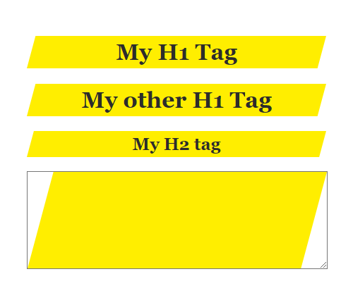

# CSS Paint Worklet - Highlight
Implements a highlight paint worklet for marking elements with a highlight color



## Usage: 
In `<style>` or `*.css:`
```
.myElement {
    /* Fallback for browsers that can't display the CSS Houdini stuff */
    background-image: linear-gradient(#FFEE00, #FFEE00); 
    /* Using our paint worklet */
    background-image: paint(highlight);
    /* Using custom properties for our paint worklet */
    --highlight-color: #FFEE00;
    --highlight-angle: 15deg;
}
```

## Links: 

- [MDN - CSS Painting API](https://developer.mozilla.org/en-US/docs/Web/API/CSS_Painting_API)
- [Can I Use - CSS Paint API](https://caniuse.com/css-paint-api)